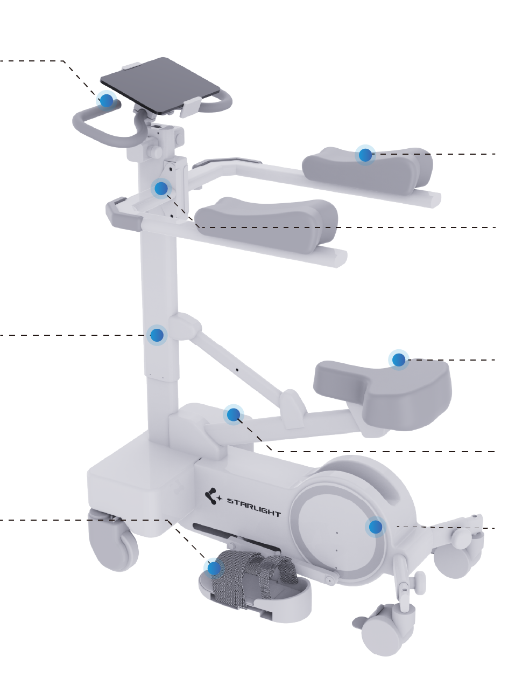

# 星荧科技官网

这是一个静态官网项目，页面以原生 HTML、CSS、JavaScript 实现。项目当前没有构建流程，直接通过浏览器或静态服务器访问 HTML 文件即可运行。

## 技术结构

- `*.html`：各页面主体内容。每个页面只保留该页面特有的内容区，公共头部和页脚由 JavaScript 注入。
- `styles.css`：全站样式入口，包含导航、首页、产品详情页、服务支持、关于我们、表单、响应式断点等样式。
- `app.js`：公共组件和页面交互逻辑，包括 header/footer 渲染、导航菜单、产品标签页、FAQ、下载中心 tab、表单占位提交等。
- `assets/`：网站实际引用的图片资源。
- `网页素材/`、`网页设计/`：原始素材和设计参考，已在 `.gitignore` 中忽略，不建议作为线上引用路径。

## 页面组织

主要页面包括：

- `index.html`：首页。
- `products.html`：产品中心，包含产品分类 tab。
- `product-medical.html`：医用版下肢康复训练机器人详情页。
- `product-home.html`：家庭版下肢康复训练机器人详情页。
- `medical.html`：医疗合作。
- `downloads.html`：下载中心。
- `after-sales.html`：售后服务入口。
- `faq.html`：常见问题详情。
- `complaint.html`：我要投诉表单页。
- `about.html`：关于我们。
- `contact.html`：联系我们。
- `trial.html`：预约体验表单页。
- `placeholder.html`：暂未开发功能的临时跳转页。

新增页面时建议复用现有结构：

```html
<header class="site-header light" data-header></header>
<main>
  <!-- page content -->
</main>
<footer class="site-footer"></footer>
<script src="./app.js"></script>
```

如果页面首屏是深色背景，可以将 header 改为：

```html
<header class="site-header dark" data-header></header>
```

## 公共导航

导航数据集中在 `app.js` 的 `navItems` 中维护。普通一级菜单、带二级菜单的菜单、产品中心特殊 hover 菜单都由这里生成。

当前有三种导航形态：

- 普通链接：直接点击跳转，例如 `医疗合作`。
- 二级菜单：一级标题点击可展开/收起，桌面 hover 也可展开，例如 `服务支持`、`关于星荧`、`获取产品`。
- 产品快速菜单：`产品中心` 保留点击进入 `products.html`，同时桌面 hover 展开分类产品菜单。

产品中心菜单使用 `productMenu` 数据：

```js
{
  label: "产品中心",
  href: "products.html",
  productMenu: [
    {
      category: "下肢康复训练机器人",
      href: "products.html#rehab",
      items: [
        { label: "医用版", href: "product-medical.html", desc: "医疗机构适用" },
        { label: "家庭版", href: "product-home.html", desc: "居家康复训练" },
      ],
    },
  ],
}
```

产品菜单样式主要在 `styles.css` 中的这些选择器：

- `.nav-product-menu`
- `.nav-product-group`
- `.nav-product-category`
- `.nav-product-link`

移动端汉堡菜单会将产品分类静态展开。菜单高度不足时，`.site-header.open .main-nav` 使用 `max-height` 和 `overflow-y: auto` 处理滚动。

### 菜单滚动状态与透明效果

公共 header 的滚动状态在 `app.js` 的 `renderHeader()` 中维护。核心逻辑是监听 `window.scrollY`，并给 `<header data-header>` 切换 `.scrolled` 类。

默认规则：

- 普通浅色 header：没有额外参数时，滚动超过 `0px` 即进入 `.scrolled`。
- 深色 header：没有额外参数时，滚动超过 `120px` 进入 `.scrolled`。
- 支持在 HTML 上通过 `data-scroll-threshold` 覆盖进入阈值。
- 支持通过 `data-scroll-reset-threshold` 设置回滚恢复阈值，形成滞后区间，避免临界点来回抖动。

首页当前配置：

```html
<header
  class="site-header dark"
  data-header
  data-scroll-threshold="120"
  data-scroll-reset-threshold="96"
></header>
```

含义：

- 向下滚动超过 `120px`：添加 `.scrolled`，菜单进入半透明状态。
- 向上滚动回到 `96px` 以内：移除 `.scrolled`，菜单恢复实心深色。
- `96px` 到 `120px` 之间保持当前状态，用来减少快速滚动时的闪动。

`styles.css` 中深色 header 不直接在同一个背景上切换 `background`，而是使用两层伪元素交叉淡入淡出：

- `.site-header.dark::after`：实心深色背景，初始显示。
- `.site-header.dark::before`：半透明深色背景，`.scrolled` 时显示。
- `.site-header.dark.scrolled::before` 和 `.site-header.dark.scrolled::after` 只切换 `opacity`。

这样做是为了避免快速向上滚动接近顶部时，浏览器在合成层重绘中短暂露出页面白底，造成“闪白”。如果后续要调整透明效果，优先改：

```css
.site-header.dark {
  --header-bg: rgba(43, 43, 43, 0.4);
}

.site-header::before,
.site-header::after {
  transition: opacity 0.18s ease;
}
```

如果只想调触发时机，优先改页面 HTML 上的 `data-scroll-threshold` 和 `data-scroll-reset-threshold`，不要在 JS 里写死页面专用数值。

## 响应式设计

项目主要断点：

- `1280px`：中大屏内容收紧，主要处理卡片、图文区、产品标注区域。
- `1024px`：导航切换为汉堡菜单；部分布局开始压缩或转为紧凑版。
- `768px`：手机布局，许多多列区域改为单列。

产品详情页首屏使用类似首页 hero 的比例控制：

- `.detail-hero`
- `.detail-hero-product`
- `.detail-hero-copy`
- `.medical-detail-hero ...`

如果要调产品图位置，优先改产品专属规则，例如：

```css
.medical-detail-hero .detail-hero-product {
  left: ...;
  top: ...;
  width: ...;
}
```

不要直接改全局 `.detail-hero-product`，除非两个详情页都需要同步变化。

## 图片标注系统

产品交互图和参数图使用同一套标注结构：

```html
<div class="annotated-image parameter-diagram" style="--diagram-width: 957px; --diagram-ratio: 957 / 1295;">
  
  <span class="param-callout left p1" style="--x: 6%; --y: 8%; --w: 210px;">...</span>
</div>
```

关键点：

- `--diagram-width` 是设计图原始宽度。
- `--diagram-ratio` 必须和图片真实比例一致。
- 标注位置用 `--x`、`--y` 百分比绑定到图框。
- `.callout` 用于产品交互图。
- `.param-callout` 用于主要参数图。
- `--label-scale` 在断点中控制标注文字缩放。

如果标注看起来和图片错位，优先检查：

- 图片真实尺寸是否和 `--diagram-ratio` 一致。
- 是否给图片单独加了 `max-height`、`transform` 或位移。
- 是否在断点里覆盖了 `.parameter-diagram` 或 `.medical-parameter` 的宽度。

## 型号配置表

`product-home.html` 和 `product-medical.html` 的 `models section muted` 使用同一套结构：

- `.model-config`：整体配置表 grid。
- `.model-labels`：左侧蓝色指标栏。
- `.model-card`：每个型号卡片。
- `.model-card-head`：型号标题区域，上下蓝线和小产品图。
- `.model-dot`：圆点标记。

桌面为左侧指标栏 + 三列型号对比。`768px` 以下切换为单列卡片，每张卡片显示字段名和对应值。

常改位置：

```css
.model-card-head {
  min-height: ...;
  padding: ...;
}
```

控制型号标题框高度和文字位置。

```css
.model-card-head img {
  top: 0;
  transform: translateY(-50%);
}
```

控制表头小产品图相对上蓝线的位置。

## 页面交互

`app.js` 中的初始化函数：

- `renderHeader()`：渲染公共头部和导航。
- `renderFooter()`：渲染公共页脚。
- `initProductTabs()`：产品中心 tab，并支持 `products.html#osa` 直接打开 OSA 分类。
- `initFaqPage()`：FAQ 侧边栏和问题内容渲染。
- `initComplaintForm()`：投诉表单占位提交。
- `initDownloadTabs()`：下载中心分类切换。
- `initTrialForm()`：预约体验表单占位提交。

表单目前只做前端占位提交，会在控制台输出 payload。后续可以在这些函数里接入：

- 后端 API。
- 邮件发送服务。
- 数据库存储。

## 搜索设计预留

当前 header 中的搜索还不是可输入搜索框。适合先做纯前端站内搜索：

- 将页面标题、关键词、链接维护为一个 JS 搜索索引。
- header 中替换为真实 `<input type="search">`。
- 输入时在前端过滤并显示结果面板。

后续如果接 CMS 或数据库，可以保留 UI，把数据源替换为 `/api/search?q=...`。

## 开发注意事项

- 这个项目目前没有打包流程，修改后直接刷新浏览器查看。
- 修改 `app.js` 后建议运行：

```bash
node --check app.js
```

- 图片资源应放在 `assets/` 下，并使用相对路径引用。
- 不要直接引用 `网页素材/`、`网页设计/`，这两个目录是源素材和设计参考。
- 公共导航、页脚不要在每个 HTML 页面手写，应继续通过 `app.js` 统一维护。
- 大范围改响应式样式时，优先检查 `1280px`、`1024px`、`768px` 三个断点。
